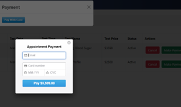

# ABC LABORATORIES

The Laboratory Management System is a Spring-boot based designed to facilitate patients to make appointments online. It offers a set of a set of RESTful API end points for booking and managing appointments, user authentication, maintains doctor profile details, generate test reports and other reports. 


## Tech Stack

**Framework:**  Spring Boot and ReactJS

**Language:** Java • Database – MongoDB 

**Build tool:** Visual Studio Code

**Dependencies Used:**

**Spring-boot Starter-Web:** provides support for building web applications, including RESTful APIs 

**Spring boot starter MongoDB:** Enables integration with MongoDB, allowing the application to interact with database. 

**Lombok:** A library to reduce getters and setters and other repetitive code 

**Model Mapper:** Simplifies mapping between objects facilitating data transfer and conversion 

**javax.mail:** provides support for sending and receiving email messages within the application using JavaMail API 

**Stripe Java:** Allows integration with the Stripe payment gateway to handle online payments securely in the application -More details can be viewed in pom.xml


## Project Structure

Project Structure 

**Main Application class –** The entry point for the application is defined in the main class 

**Entities –** User, Appointment, Test, Test Result, Doctor Profile, Payment • Repository – MongoDB repository interfaces manage data access. 

**Service Class –** Business logic is implemented in service classes for managing appointments, authentication, test report generation, payment gateway, email service 

**Controller –** These define and document RESTful API endpoints for booking appointments, user authentication, test and doctor details and payment.


## API Endpoints

---

## Authentication

- **Signup for New User**
  - `POST /api/auth/register`

- **View All Users**
  - `GET /api/auth/viewusers`

- **Edit User Details**
  - `PUT /updateuser/{id}`

- **Delete User**
  - `DELETE /deleteuser/{id}`

- **Login**
  - `POST /api/auth/login`

## Appointments

- **Make Appointments**
  - `POST /api/appointment/create`

- **View All Appointments**
  - `GET /api/appointment/viewall`

- **View Appointments by User**
  - `GET /api/appointment/{username}`

- **Update Appointments**
  - `PUT /api/{appointmentId}/update`

- **Cancel Appointments**
  - `PUT /api/{appointmentId}/cancel`

## Doctors

- **Create Doctor details**
  - `POST /api/doctors/adddoctor`

- **View Doctor details**
  - `GET /api/doctors/viewall`

- **Update Doctor details**
  - `PUT /api/doctors/update/{id}`

- **Delete Doctor details**
  - `DELETE /api/doctors/delete/{id}`

## Tests

- **Create Test**
  - `POST /api/tests/addtest`

- **View Tests**
  - `GET /api/tests/viewall`

- **Update Tests**
  - `PUT /api/tests/update/{id}`

- **Delete Tests**
  - `DELETE /api/tests/delete/{id}`

## Test Results

- **Update Test Results**
  - `POST /api/result/create`

## Payments

- **Make Payment**
  - `POST /api/payment/charge`

---


## API Reference

#### For more detailed documentation, refer to the [official Spring guide]

```http
  https://spring.io/guides/tutorials/react-and-spring-data-rest
```
---
##Screen Shots


<br><br><br>

<br><br><br>

<br><br><br>

<br><br><br>

<br><br><br>

<br><br><br>

<br><br><br>

<br><br><br>

<br><br><br>

<br><br><br>


